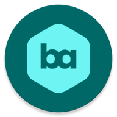

# Backgroundable - Android Wallpaper App

Backgroundable is an Android app that allows you to set beautiful wallpapers for your phone. With millions of images and thousands of categories to choose from, you can easily find the perfect wallpaper to personalize your device. The app also offers various features, including downloading images in six different resolutions, M3 dynamic themes, and much more.

## Features

- **Search in Millions of Images:** Explore a vast collection of images from various sources to find the perfect wallpaper for your device.
- **Thousands of Categories:** Browse through thousands of categories to discover wallpapers that match your preferences and style.
- **Download in Any 6 Resolution:** Choose from six different resolutions to download wallpapers that perfectly fit your screen.
- **M3 Dynamic Theme:** Enjoy dynamic themes that change automatically based on your preferences and time of day.
- **And Much More:** Backgroundable offers a range of additional features to enhance your wallpaper experience.

## Screenshots

| Home                                     | Media List                               | Media Detail                             | Search                                   | Settings                                 |
|------------------------------------------|------------------------------------------|------------------------------------------|------------------------------------------|------------------------------------------|
|  |  |  |  |  |

## Figma Link

Explore the app's design and mockups on Figma by following this link: [Figma Design](https://www.figma.com/file/38WKj9umF8Wz84n21Uxn2O/Backgroundable?type=design&node-id=0%3A1&mode=design&t=g4D2qNkdP51Gopms-1)

## Powered by [Pexels API](https://www.pexels.com)

Backgroundable is powered by the Pexels API, which provides a vast collection of high-quality images for use in the app. According to the Pexels API, thousands of new images are added every day, ensuring a constantly growing selection for our users.

## Download

[Download the latest version of Backgroundable](https://github.com/javadjafari1/Backgroundable/releases)

## Installation

1. Download the APK from the link above.
2. Open the APK file on your Android device.
3. Allow installation from unknown sources if prompted.

## Usage

1. Open Backgroundable on your Android device.
2. Browse or search for wallpapers using the intuitive interface.
3. Select a wallpaper you like.
4. Choose the resolution that matches your device's screen size.
5. Download or set the wallpaper as your background.

## Regular Updates

We are committed to providing the best experience for our users, which is why Backgroundable is regularly updated with new features, improvements, and bug fixes. The continuous addition of fresh images from the Pexels API ensures that you have access to the latest and trending wallpapers.

## Contributing

We welcome contributions from the open-source community. If you would like to contribute to Backgroundable, please follow these guidelines:

1. Fork the repository and create your branch from `develop`.
2. Make changes and test thoroughly.
3. Create a pull request with a detailed description of the changes.

## Issues

If you encounter any bugs, glitches, or have suggestions for improvements, please create an issue in the GitHub repository.

---

We hope you enjoy using Backgroundable! Feel free to leave feedback, report issues, or contribute to the project. Happy wallpapering! 🎉
